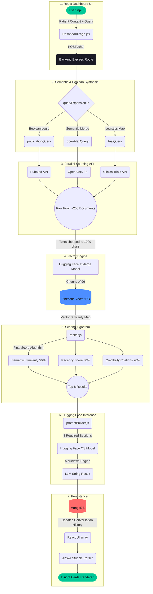

# Curalink End-to-End Pipeline Architecture

Your Curalink web app functions as a sophisticated **Retrieval-Augmented Generation (RAG)** pipeline. Here is the exact end-to-end flow of data when a user clicks "Start Session" or asks a follow-up question.

### Visual Architecture

### Stage-by-Stage Breakdown

**Stage 1: The Request**
The user inputs their patient history, disease, and specific question into the React UI (`DashboardPage.jsx`). This builds a stateless JSON payload that hits your backend `/api/chat` route.

**Stage 2: Query Expansion (`src/services/queryExpansion.js`)**
The backend doesn't just blindly search the user's question. It intelligently synthezises the inputs:
- It detects **synonyms** (e.g., matching "Parkinson's disease" to "PD").
- It constructs rigid strict **Boolean search strings** mapping specifically to medical dictionary rules.

**Stage 3: Information Retrieval (`src/services/searchFetchers.js`)**
It executes `Promise.all()` to vastly speed up fetching. It fires the constructed queries out to PubMed, OpenAlex, and ClinicalTrials in parallel. It maps the returned JSON/XML into a standardized `rawPool` containing Title, Abstract, URL, Year, Authors, and custom properties like Eligibility Criteria. These functions pull heavily—up to 250 documents at once (Depth First).

**Stage 4: Vector Generation (`src/services/embedder.js`)**
If the `rawPool` has items, it chunks the data arrays tightly into groups of 96. It strips and limits text clusters to 1000 characters and fires them directly to Pinecone using the `multilingual-e5-large` embedding model. This plots the 250 documents inside a 3D coordinate-space structure based on pure semantic meaning, allowing us to find the most "relevant" texts.

**Stage 5: RAG Ranking (`src/services/ranker.js`)**
The application scores every single document out of 100%. 
1. `50%` = How close is the vector of the document to the vector of the user's explicit question?
2. `30%` = How recently was the trial/paper published?
3. `20%` = How many times has this paper been heavily cited, and is it highly credible?
It sorts by this score, executing a brutal slice: `sort().slice(0, 8)`.

**Stage 6: AI Generation (`src/services/promptBuilder.js` & `llm.js`)**
The highly-curated Top 8 documents, alongside the conversation history array mapping, are string-stitched into a rigorous LLM Prompt commanding the system to output exactly 4 sections (Overview, Insights, Trials, Sources). The Hugging Face server organically writes the response relying exclusively on your top 8 files (No Hallucination).

**Stage 7: Persistence and UI Processing (`src/routes/chatRoutes.js`)**
The backend safely persists the newly constructed User Message and AI Response message arrays deeply into MongoDB (`Conversation.findOneAndUpdate`). Finally, it delivers the payload rapidly back to React. Your `AnswerBubble.jsx` code parses the markdown formatting natively into physical, sleek border-colored UI cards on the screen!
